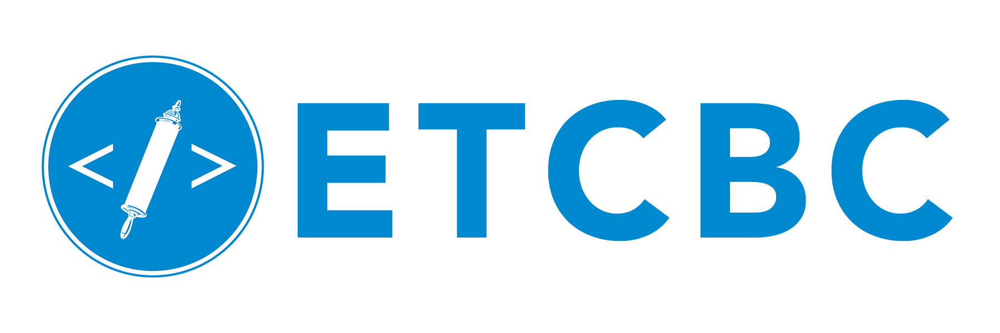

# A Probabilistic Approach to Linguistic Variation and Change in Biblical Hebrew
## Cody Kingham & Etienne van de Bijl

    
    
    

## Description
The project addresses the longstanding problem of linguistic dating of the Psalms. We will investigate the novel idea of analyzing the text by elaborating on techniques and concepts from the analysis of social networks. Specifically, a probabilistic model (Markov chain) will be developed that captures the linguistic structure of the ‘textual network’.
 
### Phase 1 
An abstraction of the text (e.g., should conjugations be represented by the same node, singular- plural distinction etc.?) is developed. The project will benefit from the richly annotated linguistic ETCBC database.
We will interpret the text elements obtained in Phase 1 as ‘agents’ in a social network and will seek to identify communities/cliques in the text-network. The rationale is that text parts that originate from different time periods show distinguishable patterns (e.g., homopholy in the text-network).
 
### Phase 2 
A Markov chain analysis of the text-network is carried out elaborating on recent findings in Markov chain theory for cluster identification, where we make use of community measures such as expected distance between text elements. An important issue is whether Early Biblical Hebrew books (EBH; e.g., Judges, Samuel, according to most scholars composed before the Babylonian Exile) and Late Biblical Hebrew books (LBH; e.g., the books of Chronicles, unmistakably post-exilic) have enough inner consistency and are separated enough from each other to be able to classify a text of unknown date (e.g., the ‘timeless’ poetry of the Psalms) to one of these language phases.
 
We believe that this research can have groundbreaking implications for the identification of text types in library search (e.g., find all poems with ‘hope’ and ‘Monday’ as joint topics). While Markov chains have been successfully applied to automatic translation, this project will explore the novel application to understanding the linguistic structure of a text.

